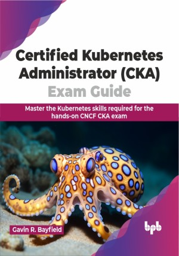

# Certified Kubernetes Administrator (CKA) Exam Guide

Conquer the CNCF Certified Kubernetes Administrator (CKA) exam

This is the repository for [Certified Kubernetes Administrator (CKA) Exam Guide
](https://bpbonline.com/products/certified-kubernetes-administrator-cka-exam-guide?variant=43185819975880),published by BPB Publications.

## About the Book
Kubernetes is the de facto industry-standard for production-grade container orchestration. The CNCF Certified Kubernetes Administrator (CKA) Certification is an in-demand, industry-recognised benchmark denoting the holder as possessing the expertise required to create, secure, manage and troubleshoot Kubernetes clusters. 

The CNCF CKA exam is a fully hands-on, command line based assessment. This guide structure follows the CKA curriculum. Start with need-to-know Kubernetes concepts and implementation details using hands-on code examples and command line walkthroughs. You will explore core concepts including cluster architecture, installation and configuration. As the book progresses, you will master security principles with RBAC, confidently deploy and manage applications, and explore the intricacies of Kubernetes storage and networking. The following chapters on Troubleshooting and Exam Preparation provide important exam and assessment environment hints and tips, command line techniques and crucial exam strategies. The final two chapters present full-length CKA practice exams with fully-worked exam-grade solutions. 

This pragmatic blend of theory, worked examples, and analysis techniques ensures the reader is primed to be successful in the real Certified Kubernetes Administrator (CKA) exam.

## What You Will Learn
• The skills and knowledge required to professionally administer Kubernetes clusters.

• Understanding of Kubernetes command line examples and task walkthroughs.

• Insight from detailed fully-worked solutions for two CKA practice exams.

• Working details for the CNCF CKA exam environment.

• How to manage Kubernetes clusters with precision and control.
